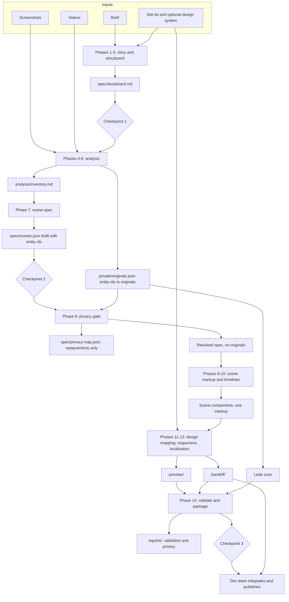

# Architecture

How the Marketing Page Animation Skill is put together, and why. For the step-by-step flow, see [workflow.md](workflow.md). The authoritative definition of the phases is `.claude/skills/marketing-page-animation/SKILL.md`, and each topic has one authoritative reference file in `.claude/skills/marketing-page-animation/references/`. This document explains how the pieces fit and does not restate their rules.

Paths below are relative to the skill folder (`.claude/skills/marketing-page-animation/`) unless they start with `marketing-pages/` (the per-page work directory).

## 1. Purpose and users

The skill lets people on the marketing and customer-success teams, who have **no access to the website's code**, build an animated product-story page that looks native to the company website (the first target is the Optmyzr Hugo site). Where a screenshot or screen recording shows product UI, the skill rebuilds that UI as live HTML, CSS and JavaScript instead of embedding the media. The result is light, animated, translatable and free of customer data, because sensitive values are replaced with synthetic ones instead of being blurred.

The user works with Claude in a conversation, approves the work at three checkpoints, and then hands the result to the dev team, who integrate and publish it. **The skill never pushes, merges or publishes to the live site.**

| Who | What they do |
|---|---|
| Marketing or customer-success user | Supplies a brief, screenshots and videos. Approves the storyboard, the scene spec and the final review. Shares the preview. Sends the handoff bundle to the dev team |
| Claude, running the skill | Analyzes the references, writes the spec, replaces sensitive data, builds and animates the scenes, checks the result, packages the outputs |
| Dev team | Maintains the site kit with the skill owner, verifies the assumptions listed in the handoff, integrates the bundle, runs the site's localization, review and publishing process |
| Skill owner | Builds and refreshes the site kit, extends the runtime and references |

Goals: anyone on the team can produce a page in the site's look; product UI is faithful to its reference; no real data leaks; the output is responsive, accessible, reduced-motion aware and maintainable by the dev team. Non-goals: a visual editor or hosted service, pixel-perfect automated cloning, framework-specific output beyond what the site itself uses, video editing (videos are analysis inputs only), and any publishing.

## 2. Outputs and modes

### 2.1 Two outputs

Every run produces two things.

1. **The preview page** (`preview/`): a self-contained page that looks and animates like the real site, with the site's header, footer, tokens and layout patterns. It opens from a folder with no build step. The user reviews it and may share it with stakeholders.
2. **The handoff bundle** (`handoff/`): what a developer needs to add the page to the site without guessing: the scene as a site-style component, English page content, UI strings, assets, the sanitized scene spec, storyboard, design mapping, a privacy report, the validation report and a plain-language README that lists kit gaps and unverified conventions. See `references/handoff-bundle.md`.

**One markup, two homes.** The scene and page markup is written once and used unchanged in both outputs. There is no "demo version" that cannot be handed off.

### 2.2 Two modes

| | Mode A (default) | Mode B |
|---|---|---|
| Where | Anywhere; no repo access | Inside a checkout of the site (a `component-library/` folder and a Hugo config are present) and the user says so |
| Site knowledge from | The bundled site kit | The repo itself |
| Output | Preview and handoff bundle in the work directory | Files written directly into the repo's editable areas; no bundle needed, reports still produced |
| Localization | English source only; preview-only language toggle allowed | English source in the repo; the site's own process and parity validator produce other languages |
| Pipeline | None | In a Marketing-OS repo, plugs into its agents and review gate (`references/marketing-os-integration.md`) without ever writing the approval marker |

If unsure, use Mode A. In Mode B the work directory stays outside anything that gets staged.

## 3. The site kit

The site kit (`site-kit/`) is a snapshot of the website's design and conventions that stands in for repo access. It holds design tokens, the token class map, fonts and breakpoints, the header and footer, section patterns, animated patterns, active languages and tone rules, translatable field names, and component blueprints. `site-kit/MANIFEST.md` lists every item with a status and a capture date.

| Status | Meaning |
|---|---|
| verified | Taken from the real code, from the design team's own export, or confirmed by a developer |
| observed | Read from the public rendered site: accurate for looks, not necessarily for code structure |
| unverified | Taken from documentation or inference: usable, but listed in the handoff |
| missing | Not in the kit yet: the page uses the closest pattern, records a **kit gap**, and never invents |

The kit is maintained by the skill owner, not by each user, and contains only public information. Today it holds the design tokens (from a Figma variables export, via `scripts/normalize_design_system.py`); rendered patterns, the class map, developer-only items and all localization discovery answers are still missing. Details: `references/site-kit.md`.

## 4. Scene model

### 4.1 The scene spec is the intermediate representation

Going straight from a screenshot to markup makes results hard to review and hard to fix. Claude first writes a **scene spec**, `spec/scenes.json`: the single source of truth for each scene's components, copy, sensitivity classes, timeline, final state and accessibility description. A person can correct "that is a tab bar, not a button group" before any code exists; the privacy pass, localization and animation all operate on the spec; and changing the spec and regenerating beats patching generated markup.

A scene is one product moment that proves one claim. Its definition keeps three layers separate:

| Layer | Holds | Changes when |
|---|---|---|
| Structure | Component tree, states, timeline | The story changes |
| Content | All text, numbers, chart and table data, keyed, each with a role, a `translate` flag and a sensitivity class | The language, example or data changes |
| Presentation | Product theme, primitive styles, responsive rules | The product look or screen size changes |

A compact sketch of the structure layer (the vocabulary, fields and validity rules are defined in `references/ui-scene-system.md`, and the JSON Schema is in `schemas/scene.schema.json`):

```json
{
  "id": "assistant-recommendation-approval",
  "claim": "Ask in plain language, review a proposed change, and approve it in one click",
  "stage": { "designWidth": 720, "aspectRatio": "4 / 3" },
  "components": [
    { "id": "composer", "type": "composer", "content": "composer" },
    { "id": "q1",   "type": "message",  "variant": "user",      "content": "q1" },
    { "id": "a1",   "type": "message",  "variant": "assistant", "content": "a1" },
    { "id": "appr", "type": "approval", "content": "appr" }
  ],
  "states": [
    { "id": "initial",  "visible": ["composer"] },
    { "id": "approved", "visible": ["composer", "q1", "a1", "appr"], "final": true }
  ],
  "timeline": [
    { "id": "s1", "at": 400,     "do": "user-types",       "target": "composer", "source": "q1" },
    { "id": "s2", "after": "s1", "do": "response-streams", "target": "a1" },
    { "id": "s3", "after": "s2", "delay": 800, "do": "approval-clicked", "target": "appr", "essential": true }
  ],
  "responsive": { "designWidth": 720, "minTextPx": 11, "variants": [ { "name": "compact", "below": 520, "strategy": "simplify" } ] },
  "accessibility": { "name": "Assistant recommendation demo", "description": "A user asks a question and approves the proposed change." }
}
```

While the spec is a draft, sensitive text is written as an entity reference (`{{acct-1}}`), never as a value. It is resolved to a synthetic value in phase 8, after which the spec is safe to share.

### 4.2 Two style scopes

The page has two visual languages that must not mix.

| | Page and scene frame | Product UI inside the scene |
|---|---|---|
| Source | The site kit (and a supplied design system, if any) | The reference screenshots and videos |
| Styled with | The site's own classes and tokens | `--product-*` custom properties on the scene root, with `pu-` prefixed primitive classes, scoped under `.product-ui[data-scene]` |
| Rule | Never restyled to match the product | Faithful to the reference, never restyled to match the brand unless a branded recreation is explicitly requested |

The scene root isolates itself (own font, size, spacing, containment) so page styles cannot leak in. Rules and precedence: `references/design-system.md`.

### 4.3 Declarative timelines and one shared player

Animation is data, not per-scene code. A timeline is an ordered list of steps over a millisecond clock, using relative timing (`after`, `with`, `delay`). Steps use a two-level vocabulary: **product interaction recipes** with meaning (`user-types`, `system-processes`, `response-streams`, `recommendation-appears`, `approval-clicked`, `success-state`, `data-updates`, and others) that expand into **generic motion** (`reveal`, `type`, `stream`, `count`, `draw`, `highlight`, `move`, `wait`, `loop`). A recipe appears only if the video shows that interaction, and every step carries a basis: observed, inferred or assumed. Only `opacity` and `transform` animate, and layout is reserved in advance. Full rules: `references/animation-system.md`.

Every scene is **authored in its complete final state**. The player rewinds it on load and replays it; without JavaScript, or with `prefers-reduced-motion`, the visitor sees the final state. The player reads typed and streamed text from the rendered elements, so every language animates at a natural pace.

### 4.4 Responsive scenes

Each scene declares a design width, a legibility limit and at least one compact variant before it is built. Scenes scale with their container (container queries, container-relative units) and switch to a compact variant by transforming the composition (crop, stack, simplify, shorten, swap), never by shrinking until the text is unreadable. The compact variant must pass the "meaning test". Rules: `references/responsive.md`.

## 5. Layers

| Layer | Location | Role | State |
|---|---|---|---|
| Skill orchestration | `SKILL.md` | The 14 phases, the always-applicable rules, the three checkpoints. Short, loaded automatically | Done |
| References | `references/` | One authoritative file per topic, loaded only in the phase that needs it | Done |
| Scene system | `references/ui-scene-system.md`, `spec/scenes.json` | The vocabulary and format that everything else builds on | Documented |
| Runtime player | `runtime/` | Small dependency-free scene player: viewport start and pause, controls, reduced motion, seek, one clock | Done, tested headless |
| Scripts | `scripts/` | Deterministic helpers: token normalizer, frame extraction, validators (scene, page, leak scan) | Done, tested on synthetic fixtures |
| Schemas | `schemas/` | JSON Schemas for the scene, content layer, privacy map and originals register | Done |
| Templates | `templates/` | Brief template, handoff README template, scene component starter | Brief and README done; component starter planned |
| Site kit | `site-kit/` | The snapshot of the site: tokens, patterns, conventions, statuses | Tokens only |

Keeping animation in one shared runtime, instead of generating bespoke JavaScript for each scene, keeps output small and consistent: scenes describe what happens and the player decides how. Scripts are added only when a stage needs them, so that Claude does not do mechanical work by hand.

## 6. Data flow

The skill is a pipeline of phases that communicate through files. Each phase reads earlier artifacts and writes its own; a later phase that finds a problem returns to the earliest artifact that owns it.



The originals flow only into the privacy gate and the leak scan. Nothing downstream of phase 8 ever reads `.private/` except the scanner.

## 7. Work directory layout

Each page is a self-contained folder, `marketing-pages/<slug>/`, in a location the user chooses. Analysis material contains real customer data, so it is kept apart from anything shared. In Mode B the work directory lives outside the shipped areas, for example in the repo's untracked artifacts folder.

```
marketing-pages/<slug>/
  input/        brief, references/{images,videos}
  analysis/     frames, contact sheets, per-reference records, inventory.md
  spec/         storyboard.md, scenes.json, design-system.json, design-mapping.md,
                privacy-map.json (replacements only, no originals)
  preview/      the shareable preview page
  handoff/      the handoff bundle
  reports/      validation.md, privacy.md (no original values), screenshots/
  .private/     originals.json, OCR output, frame notes: original sensitive values
```

| Folder | Shareable? |
|---|---|
| `preview/`, `handoff/` | Yes, after the final leak scan passes |
| `spec/` | Yes: it contains only resolved values and replacement rules |
| `reports/` | Yes, but screenshots show the rebuilt page only, never a reference |
| `input/`, `analysis/`, `.private/` | Never. Git-ignored, and never copied into `preview/`, `handoff/` or a repo |

## 8. Privacy model

Blurring keeps the real data in the DOM or the pixels, can often be reversed, and looks unfinished. This skill **replaces** instead.

- **Entities, not strings.** Each real thing (an account, a campaign, a person) is an entity with an id (`acct-1`, `camp-3`). The first time a sensitive value is seen in a screenshot or frame, it is registered in `.private/originals.json`, and from then on only the entity id appears in analysis records, the inventory, the draft spec and chat.
- **Two files, one join.** `.private/originals.json` holds originals and is never shared. `spec/privacy-map.json` holds format templates and replacements only. They meet only through entity ids.
- **Random and format-preserving.** Phase 8 generates each replacement from a secure random source using only the value's shape (length, grouping, character classes). Nothing is derived from, hashed from, or a partial keep of the original. Reserved ranges are used where they exist (example domains, fiction phone blocks, documentation IP ranges). Amounts are re-chosen from the story and every dependent total, percentage and chart is recomputed.
- **Consistent.** One entity has one replacement in every scene, state, language, URL, alt text and surface form, frozen once written.
- **A required gate.** Phase 8 must complete, with every entity reference in the spec resolved, before any markup is written. Forbidden throughout: blur, partial masks, overlays, CSS masking, and run-time text swapping.
- **A final scan.** Phase 14 scans every shared file, and in Mode B every changed repo file, for originals in exact, normalized, encoded, reversed and fragment form, for unregistered sensitive-looking patterns, for values built at run time, and for media leaks. Any hit is a blocker.
- **Reports without originals.** `reports/privacy.md` and the bundle's `spec/privacy-report.md` give counts by class, scan results, judgment calls and residual risks.

The skill does not decide legal or compliance questions; it tells the user when the material may need a review before it is shared. Full rules: `references/privacy-masking.md`.

## 9. Localization model

The website already has a localization mechanism, and the skill plugs into it. It never builds a parallel one.

- **Per-language static pages for SEO.** The site renders a separate static page per language under its own URL prefix, with its own metadata, which is good for indexing and works without JavaScript. The skill reuses that; it does not translate on the client.
- **English source only in the bundle.** The bundle carries English content and UI strings in the site's format and translatable field names. The dev team's normal localization process produces the other languages. In Mode B the skill hands over English and runs or requests that process.
- **All text is data.** Every visible string, including text inside reconstructed product UI, alt text, ARIA labels and metadata, is a field or a string key. Nothing is baked into an image, SVG or script.
- **The site's own chrome.** Header, footer, navigation and the language selector come from the kit and are not rebuilt.
- **Preview-only toggle.** In Mode A the preview may include a clearly labelled language toggle using drafted translations, so reviewers can check layout in other languages. It is a review aid: never part of the bundle, never reused as the site's mechanism.
- **Built to survive any length.** No fixed text boxes, a +40 percent expansion test, Japanese and any right-to-left handling checked, and animation that reads rendered text and sizes durations from it.
- **Discovery is pending.** Until someone inspects the repo, every localization fact (language definition, file layout, translatable-key list, URL rules, helpers) is `unverified` or `missing` in the kit. Rules and the discovery table: `references/localization.md`.

## 10. Target stack

These details describe the stack the skill was first built for. They come from documentation of the site's conventions and have **not been checked against the real repository**, so all of them are **unverified** and the handoff README lists them for the dev team to confirm. In Mode B the real repo overrides this table.

| Aspect | Working assumption | Status |
|---|---|---|
| Static site generator | Hugo, with a separate page per language | unverified |
| Components | Bookshop: each scene is a triplet (blueprint with a default for every field, Hugo template, stylesheet) under `component-library/components/<name>/`, bound to a page through `content_blocks` | unverified |
| Styling | Tailwind utility classes generated from a design-token file; only classes already used by sibling components are safe to use | unverified |
| CMS | CloudCannon, with schemas that new pages start from | unverified |
| Content layout | English under `content/english/...`, other languages under their own folders; data in `data/<lang>/`; UI labels in `i18n/<lang>.toml` | unverified |
| Translation | Only fields on a translatable-key list are translated; a process mirrors English into each active language, and a parity validator checks it | unverified |
| Scripts | Loaded from asset files the way existing animated components load theirs; no inline scripts or raw HTML embeds in content | unverified |

Design tokens are the one exception: they come from the design team's own export and are treated as verified in the kit, though not yet compared with the rendered site. Details: `references/hugo-bookshop-target.md`.

## 11. Safety and security principles

1. **Never publish.** No push, merge, deploy or approval marker. The run ends with a preview and a bundle, and sharing the preview link is the user's decision.
2. **Never invent the website.** Navigation, header, footer, forms and patterns come from the kit. Gaps are flagged, not filled in.
3. **Never invent product UI or text.** Unreadable text, unseen states and unexplained changes are recorded as uncertainties, and the simpler faithful scene is preferred over an impressive partly invented one.
4. **Never leak data.** Replacement at transcription time, a required gate before code, a final scan, and no originals in chat, reports or commit messages. If an original is ever committed, deleting it later does not remove it from history, and the user is told.
5. **Scripts stay out of content.** No inline scripts, inline event handlers or raw HTML embeds in content files; scripts live in asset files. Reviewers treat those as security risks.
6. **Stay in the editable areas.** In Mode B only content, layouts, component library, i18n, data, static and assets may change. Configuration, CMS config, module files, pipeline files and the token source are escalated to the dev team, never edited.
7. **Keep it light and accessible.** No frameworks or large media; reduced motion, keyboard access, contrast, names and descriptions are part of done.
8. **Ask when it matters.** Ask about anything that changes the outcome, and collect scene questions once, at the spec checkpoint.

## 12. Implemented versus planned

| Area | State |
|---|---|
| Skill entry point, 14 phases, rules, checkpoints (`SKILL.md`) | Implemented |
| Reference guidance for every topic (`references/`) | Implemented |
| Handoff and brief templates | Implemented |
| Design token normalizer (`scripts/normalize_design_system.py`) and the token files in the kit | Implemented |
| Runtime scene player (`runtime/`), demo and headless tests | Implemented |
| JSON Schemas (`schemas/`) | Implemented |
| Frame extraction and validators (`scripts/extract_frames.py`, `scripts/validate/`) | Implemented; not yet run on real reference material |
| Scene component starter (`templates/page/`) | Pending; needs an animated component from the real repo. A worked example scene is in `templates/example-scene/` |
| Site kit: header, footer, section patterns, animated patterns, class map | Pending; needs captures of the public site |
| Site kit: localization discovery, translatable field names, component blueprints | Pending; needs repo access or dev-team input |
| Reference implementation (the Optmyzr on Slack page described as a scene spec) | Planned; will prove the spec format and the player |

## 13. Open questions

1. Repo access (even read-only) to run the localization discovery and confirm the target stack.
2. Which rendered pages to capture for the kit, and who supplies the developer-only items (translatable field list, component blueprints, an animated component's source).
3. How scripts should be wired into a Bookshop page, if no existing pattern is found.
4. Whether ffmpeg is available on every teammate's machine, or frame extraction needs a fallback that works from still frames the user supplies.

## 14. Superseded ideas

Earlier drafts of these docs described a different delivery model. These ideas were dropped:

| Dropped idea | Why |
|---|---|
| A standalone `build/` output folder with its own `index.html`, `css/`, `js/` and `assets/` as the deliverable | Users have no repo and the dev team integrates into the Hugo site, so the deliverable is now a preview plus a handoff bundle of site-style components and content |
| `locales/<lang>.json` files with `data-i18n` keys resolved in the browser | It would create a parallel translation system, hide text from search engines, and bypass the site's own process. The site's per-language static pages and translatable fields are used instead |
| A language switcher shipped with the page, with `lang` and `dir` updates from the page template | The site already has one in its header. The only switcher is a clearly labelled preview-only toggle for reviewers, and it never enters the bundle |
| A `--site-*` custom-property scheme for the whole page, mapped from the supplied design system | The page must look native, so it uses the site's own class names and tokens from the kit. Only the `--product-*` scope for the product UI remains |
| Machine translations produced by the skill and shipped in the page | Translation belongs to the dev team's process; drafts exist only in the preview and are flagged as unreviewed |
