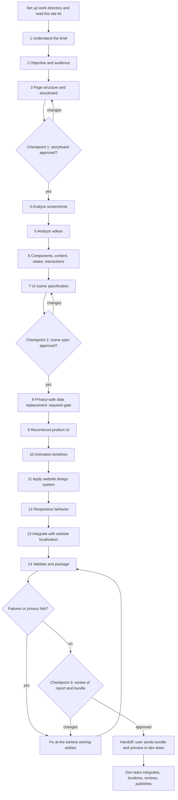

# Workflow

The end-to-end flow from a marketing user's request to a handoff the dev team can integrate. This document follows the 14 phases defined in `.claude/skills/marketing-page-animation/SKILL.md`, which is authoritative: if the two disagree, SKILL.md wins. For how the pieces fit together, see [architecture.md](architecture.md).

The run has **14 phases** and **3 user checkpoints** (after phases 3, 7 and 14). Everything between checkpoints keeps moving without asking, except when Claude hits something it must not guess. The run ends with a preview and a handoff bundle. The skill never pushes, merges or publishes.

## Who does what

| Actor | Role in the flow |
|---|---|
| Marketing or customer-success user | Supplies the brief, screenshots and videos. Answers questions, decides judgment calls (for example whether a customer name may appear). Approves at the three checkpoints. Shares the preview. Sends the bundle to the dev team |
| Claude | Does every phase: analysis, spec, privacy replacement, build, animation, design mapping, responsive work, localization preparation, validation, packaging |
| Dev team | Not involved during phases 1 to 14, except to supply site-kit items only they have. Afterwards: verifies the unverified conventions, integrates the bundle, runs localization and review, publishes |

## Flow at a glance

## Before phase 1: set up

1. Ask where to work if it is not obvious, and create `marketing-pages/<slug>/` with `input/`, `analysis/`, `spec/`, `preview/`, `handoff/`, `reports/` and `.private/`. Make sure `.private/`, `analysis/` and `input/` are git-ignored, because they hold real customer data.
2. Decide the mode. Mode A (default, no repo) uses the bundled site kit. Mode B applies only when the user is inside a checkout of the site (a `component-library/` folder and a Hugo config) and says so. If unsure, use Mode A.
3. Read `site-kit/MANIFEST.md`. Note anything the page will need that is missing or unverified, and tell the user early.
4. Confirm the required inputs: a brief and at least one screenshot or video. If an input is missing or unusable (an unreadable video, an empty brief), ask before starting. Never invent product UI that is not in the references.

## The phases

For every phase: who does the work is Claude unless the table says the user decides something. "Reference" is the file loaded for that phase.

| # | Phase | In | Out | User involvement | Reference |
|---|---|---|---|---|---|
| 1 | Understand the brief | Brief | Restated brief, gaps and assumptions, questions | Answers questions that change the outcome | `page-storytelling.md` |
| 2 | Identify the marketing objective and target audience | Restated brief | One primary objective, one primary audience, the visitor's journey | None unless unclear | `page-storytelling.md` |
| 3 | Propose the page structure and storyboard | Objective, audience, references, site kit | `spec/storyboard.md`: arc, section jobs, which reference feeds which scene, the claim each proves, kit patterns per section | **Checkpoint 1** | `page-storytelling.md`, `site-kit.md` |
| 4 | Analyze feature screenshots | Screenshots | One record per screenshot (`analysis/screenshots/<id>.yaml`); sensitive values registered as entities in `.private/` | None | `screenshot-analysis.md`, `feature-analysis.md` |
| 5 | Analyze feature videos | Videos | Frames and contact sheets, scene boundaries, observation timeline with timing and confidence, uncertainty register (`analysis/videos/<id>.yaml`); brief or hover-only sensitive values registered | None. If the video cannot be read, asks for still frames | `video-analysis.md`, `feature-analysis.md` |
| 6 | Identify components, content, states, interactions and transitions | Phase 4 and 5 records | `analysis/inventory.md`: per scene, components, text, product tokens, interaction table, ambiguities | Answers about anything unreadable | `feature-analysis.md` |
| 7 | Convert observations into a UI scene specification | Inventory | `spec/scenes.json` (entity references, no original values), plain-language summary | **Checkpoint 2**: also answers the collected scene questions, each with a proposed default | `ui-scene-system.md`, `ui-reconstruction.md` |
| 8 | Privacy-safe data replacement (required gate) | Draft spec, `.private/originals.json` | `spec/privacy-map.json` (replacements only), spec resolved to synthetic values | Decides judgment calls (approved reference customers, public figures, doubtful data) | `privacy-masking.md` |
| 9 | Reconstruct the product UI as HTML/CSS/JS | Resolved spec | Each scene built once as a portable component authored in its final state | None | `ui-reconstruction.md` |
| 10 | Create animation timelines | Scenes, observation timeline | Declarative timelines played by the shared scene player, reduced-motion path | None | `animation-system.md` |
| 11 | Apply the website design system | Kit, supplied design system if any | `spec/design-mapping.md`, the preview page with the site's header, footer, tokens and patterns; kit gaps recorded | Confirms material design-system gaps or conflicts | `design-system.md`, `site-kit.md` |
| 12 | Build responsive behavior | Page and scenes | Desktop, tablet and mobile layouts, compact scene variants | None | `responsive.md` |
| 13 | Integrate with the website's localization | Page copy, kit or repo localization facts | English source in the site's format and translatable field names; every visible string as real content; optional preview-only language toggle; text-expansion check | None. Unverified localization conventions are listed for the dev team | `localization.md` |
| 14 | Validate and package | Preview, bundle inputs | `reports/validation.md`, `reports/privacy.md`, the assembled `handoff/` | **Checkpoint 3**: reviews report, screenshots and bundle | `validation.md`, `handoff-bundle.md` |

### Notes on individual phases

**Phases 1 to 3.** Ask only about gaps that change the page: the objective, the audience, the CTA, the languages. The storyboard is presented in plain business language (what the visitor sees) and is also included in the bundle so the dev team knows the intent.

**Phases 4 to 6.** From the first sighting of a sensitive value, only its entity id is written in records, the inventory, notes and chat. Text that cannot be read is marked unreadable and asked about, never filled in. Every interaction gets a cause, an effect and a transition.

**Phase 7.** The spec is the single source of truth for each scene: components, copy, sensitivity classes, timeline, final state, description, approximations and uncertainties. Corrections at the checkpoint go into the spec, not into code. Phase 7 also decides reuse: which kit patterns apply and which parts are new.

**Phase 8.** Nothing from phase 9 onward may start until the privacy map exists and every entity reference in the spec is resolved. No blurring, partial masks, overlays or run-time swapping, ever.

**Phases 9 and 10.** The scene is written once, from the resolved spec, and the same markup serves the preview and the bundle. Any change goes to the spec first, then the scene is regenerated.

**Phases 11 to 13.** The product UI stays faithful to its reference in its own scoped theme; the page around it follows the site. Localization is an integration with the site's mechanism, not a build step: if the mechanism has not been inspected, the conventions are labelled unverified rather than invented.

**Phase 14.** Runs visual, animation, responsive, accessibility, localization, performance and privacy checks on the preview and the bundle. The final privacy scan is required and any hit blocks completion. Then the bundle is assembled and the leak scan runs once more over exactly what will be shared.

## Checkpoints

| # | After phase | What the user sees | What the user decides |
|---|---|---|---|
| 1 | 3 Storyboard | The page's story, section by section, in plain language, with the claim each scene proves | Whether the story, sections and scenes are right |
| 2 | 7 Scene spec | Each scene described as what the visitor sees happen, step by step; approximations; open questions with proposed defaults | Whether each scene matches the intent, and answers to the open questions |
| 3 | 14 Validation and package | Outcome first, the few things needing a decision, the report and screenshots, the assembled bundle | Whether the page is accepted, or which items to fix |

Present checkpoints in plain business language (what the visitor sees), not files or code, unless the user asks.

## Failure and return paths

Fix a problem at the earliest artifact that owns it, then re-run everything downstream of it. Never patch generated markup when the cause is in the spec, and never patch the spec when the cause is in the analysis.

| Problem found | Fix at | Then re-run from |
|---|---|---|
| Wrong claim, missing section, wrong CTA | `spec/storyboard.md` (phase 3) | Phase 3 checkpoint, then whatever depends on it |
| Wrong reading of a screenshot or video, missing or wrong component, unreadable text answered | Analysis records or `analysis/inventory.md` (phases 4 to 6) | Phase 7 |
| A scene shows the wrong thing, wrong state, wrong step, wrong copy | `spec/scenes.json` (phase 7) | Phase 8 check, then phase 9 for that scene |
| Sensitive value found anywhere after phase 8 | `.private/originals.json` (register it) and `spec/privacy-map.json` (replacement), spec | Phase 8, then regenerate every affected scene and re-run the whole scan. Also check whether the value reached a commit, chat message or shared link and tell the user |
| Layout or fidelity mismatch in a scene | Scene markup or styles (phase 9), or the spec if the spec was wrong | Phase 9 for that scene, then 12 and 14 checks |
| Timing, order or reduced-motion problem | Timeline (phase 10) | Phase 10, then animation checks |
| Page around the scenes uses invented or hard-coded elements, tokens or classes | Design mapping and page (phase 11) | Phase 11, then 12 to 14 |
| Overflow, tiny text, broken compact variant | Responsive rules (phase 12), or the scene's declared variant in the spec | Phase 12, then 13 and 14 |
| Text overflows in a long language, hard-coded string, unverified field name | Content or fields (phase 13) | Phase 13, then 12 and 14 checks |
| Kit gap or wrong kit assumption | Record as a kit gap; if the dev team corrects it, update the site kit | Affected phases |
| Video cannot be decoded | Ask for another format or for stills of key states | Phase 5 |
| UI too complex to rebuild faithfully | Propose a simplification, crop, original illustration or (with reason recorded) a raster asset | Phase 7 |
| Design system incomplete | List gaps, propose defaults, continue only after the user accepts them | Phase 11 |

After the first version, the same rule governs edits: different copy goes to the content (phase 13), a scene change goes to the spec (phase 7), timing goes to the timeline (phase 10), a new reference goes to the analysis (phases 4 to 6), and a leaked value goes to the privacy map (phase 8).

## Handoff

After checkpoint 3, Claude tells the user plainly what to send the dev team: the `handoff/` folder (or a zip of it, only if requested) and the preview folder or link. It summarizes what was built, what was approximated, kit gaps and unverified conventions, and which translations need human review. Sharing the preview link, and any hosting of it, is the user's decision. Claude offers to revise the page from developer feedback.

## Dev team integration

This part is done by developers after handoff. The skill only prepares for it. The bundle's `README.md` is the entry point and is written so a developer can integrate the page in one sitting.

1. **Read the README.** It says what the page is, what to add where, what was reused and what is new, the kit gaps, the unverified conventions, the translatable fields, and the validation summary.
2. **Verify the unverified.** Confirm the field names, class names, file locations and script loading the README lists. Fix the `TODO(dev)` markers. If the translatable-key list lacks a field name the scene uses, that is a configuration change only the dev team makes.
3. **Add the files** to the destinations in the README's table: the scene component (blueprint, template, stylesheet) into the component library, the English page content and UI strings into the content and i18n folders, the scene player and timelines into the site's asset folder loaded the way other component scripts are.
4. **Localize.** Run the English source through the normal localization process for every active language, then the parity check. Translations are not in the bundle, or, if drafts appear in the preview, they are flagged as preview-only. Review them, especially the ones flagged for human review.
5. **Review and test.** Use the site's own build check, live preview and review gate. The skill's validation report is evidence for that review and does not replace it. In a Marketing-OS repo, run the bundle through the normal feature flow with the README as the request and the bundle files as inputs.
6. **Publish** through the site's normal process. The skill never does this.
7. **Feed back.** If integration reveals a wrong assumption, tell the skill owner so the site kit is updated and the next page benefits.

In Mode B the flow is the same, except that the files are written straight into the repo's editable areas during the run and the run ends awaiting the user's review with the change visible in the preview.
